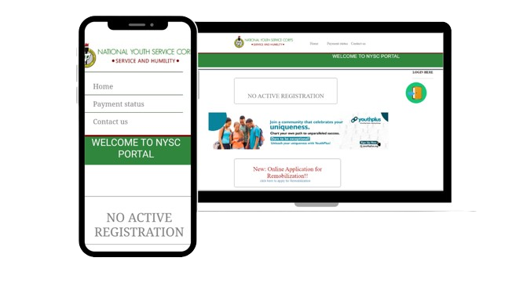

<h2 align="center">
  NYSC Website  
  <a href=" https://chukwudimma-ani.github.io/Remake-of-NYSC-homePage/" target="_blank">Link to the Website</a>
</h2>

  

 

 &nbsp;

##My Portfolio

My personal portfolio <a href="https://chukwudimma.vercel.app/" target="_blank">Chukwudimma</a> which features some of my github projects as well as my resume and technical skills. 

## Built With
 

   This project <a href="https://chukwudimma-ani.github.io/Remake-of-NYSC-homePage/">View Demo</a> The first project i made 😇
 

This project was built using these technologies.

- CSS3
- VsCode
- Html

## Features

**📱 Fully Responsive**

